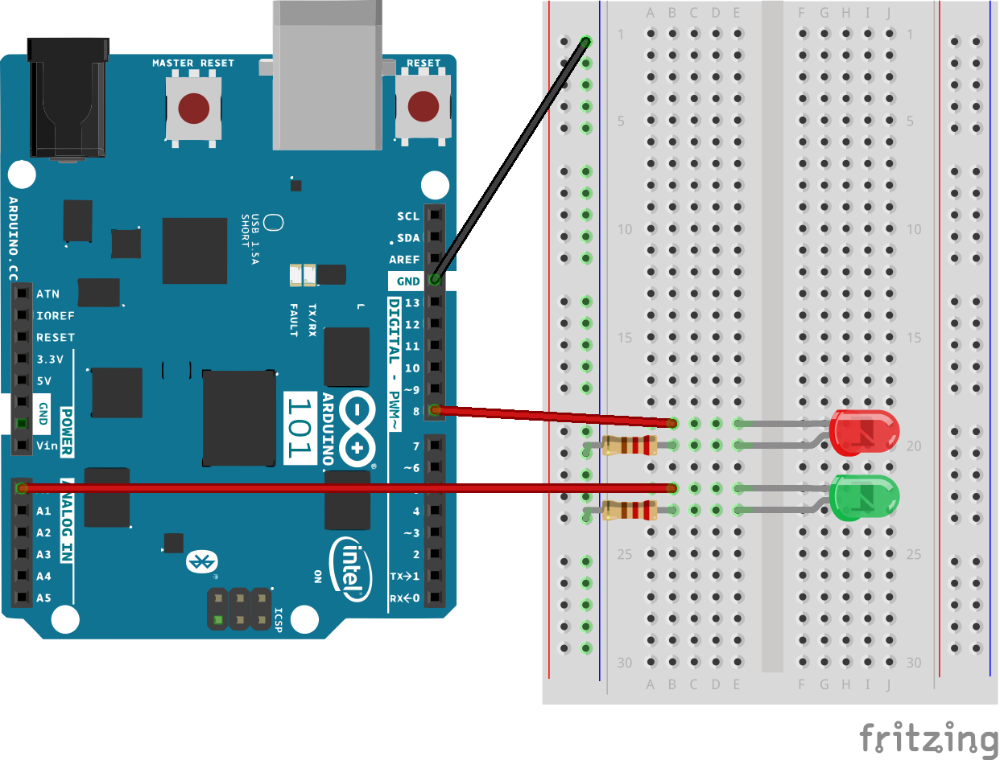
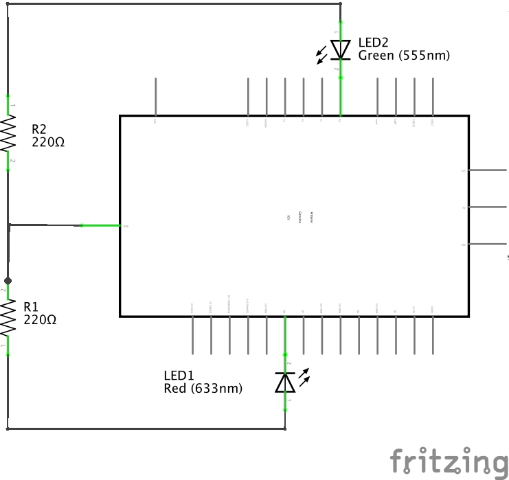

#VSCode Arduino 101 Starter Project for Zephyr

This is a skeleton project to use when writing applications for the Arduino 101 using the [Zephyr RTOS](https://www.zephyrproject.org).  It has settings inside the `.vscode` directory that allows Visual Studio Code to clean/build/debug the project.  It was implemented on a mac so only mac settings are included.  Linux should not be too different though.  Check the files inside `.vscode` for more information.

It requires the [C/C++ Extension](https://marketplace.visualstudio.com/items?itemName=ms-vscode.cpptools) for VS Code, you can install it from the command palette like so:

    ext install cpptools

The following tasks are available once you open the directory containing the project (hopefully the names are self-explanatory):
- clean
- build
- deploy
- x86_debug_server (this one starts the openocd debug server for x86 that you can attach GDB to)
- arc_debug_server (this one starts the openocd debug server for arc that you can attach GDB to)

The following launch configurations are also available:
- Debug x86 (for debugging the x86 core)
- Debug Arc (for debugging the arc code)

The project is split into an `x86` and an `arc` area where you can put the code you want to run on each core.

**NOTE** It assumes that you have a volume called `/Volumes/CrossToolNG` that contains `zephyr` and `arc-elf32` sub-directories containing the zephyr project kernel source and version **1.6.4+1.0** of the ARC tools.  It also presumes that [openocd](http://openocd.org/) is installed at `/usr/local/share/openocd`.  Take a look in `.vscode/tasks.json`, `.vscode/launch.json` and `.vscode/c_cpp_properties.json` if any of this is not true and tweak accordingly.

##Further Information

Getting the Zephyr project to work properly on the mac takes a bit of fiddling, I have made a few gists of notes that may help:

- [Building Zephyr OS on Mac](https://gist.github.com/kmp1/9d6068766b1bd841494cad3ab1128622)
- [Compiling an Application on Zephyr OS for Arduino 101 on the MAC](https://gist.github.com/kmp1/60247d08d4c9c235439872c7bfce2ab4)
- [Notes on Flashing a Zephyr Image using a JTAG Adapter on MAC](https://gist.github.com/kmp1/7fc987aebb11e73cab433264e0ed8123)

##Example Application Details

The example application uses the `arc` and `x86` cores to blink two LEDs.  The red one is controlled by the `x86` core and the green by the `arc` core.  The red is connected to pin **IO8** and green to pin **A0**.

Components Required:

- 3 x Jumper Wire
- 2 x LED
- 2 x 220 ohm Resistor

###Circuit

Following is details of the circuit.  The fritzing format file can be found at `circuit/double_led.fzz`.

####Breadboard

####Schematic

